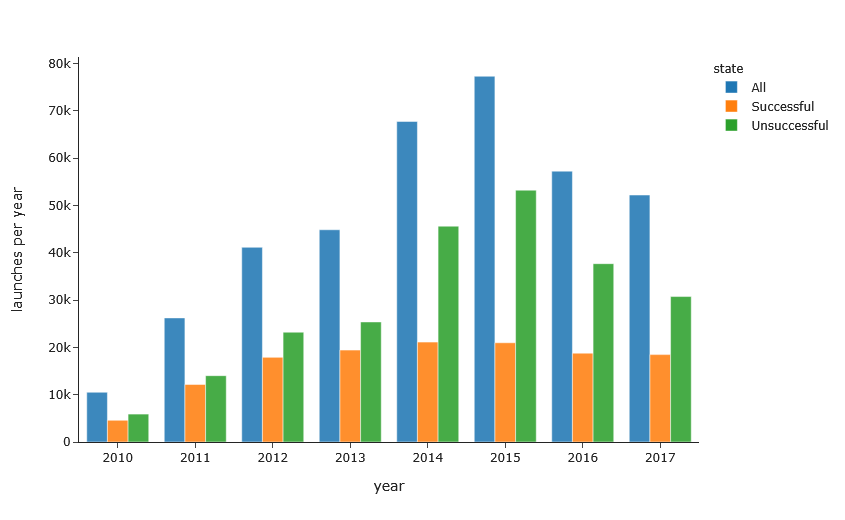

`Python`, `Pandas`, `Plotly`, `Plotly`, `Dash`, `Big Data`, `Data Cleaning`, `Data Visualizations`, `Basic Statistics`

# Kickstarter 2010-2017 - Interactive Dashboard

<br>
<p align="center">  </p>
<br>

<br>
<p align="center">  </p>
<br>

The project is based on Kickstarter data provided by Mickaël Mouillé [Dataset link](https://www.kaggle.com/kemical/kickstarter-projects)

# 1.) Load data and preprocessing

## 1.1) Imports


```python
from jupyter_dash import JupyterDash
import dash_core_components as dcc
import dash_html_components as html
import dash_bootstrap_components as dbc

import plotly.express as px
import plotly.graph_objects as go
import plotly.io as pio

from country_converter import country_converter
import numpy as np
import pandas as pd

# Import settings
pio.templates.default = "simple_white"
pd.options.mode.chained_assignment = None
```

## 1.2) Prepare data


```python
df = pd.read_csv("C:/Users/JK/Desktop/Onedrive/Programming/Datasets/kickstarter/kickstarter_data.csv",
                 parse_dates=["launched", "deadline"])

# Don't really care about the precise time of day, just the date
df["launched"] = df["launched"].dt.round('D')
df["deadline"] = df["deadline"].dt.round('D')

# Country name `N,0"` is an error in the dataset. Going to rename it `unknown`
df.loc[df["country"] == "N,0\"", "country"] = "unknown"

# Add year column for later use
df["year"] = df["launched"].dt.year

# There's 7 kickstarters that has been launched in 1970? Must be a mistake
df = df.loc[ df["launched"].dt.year != 1970, :] # Remove all 7

# Data from 2009 and 2018 are far from complete and will be misleading if not removed
except_9_and_18 = df["year"].isin([2010+i for i in range(8)])
df = df[except_9_and_18]

# state `canceled` might as well be combined with `failed` into `unsuccessful`
unsuccessful = df["state"].isin(["failed", "canceled"])
df.loc[unsuccessful, "state"] = "unsuccessful"

# Going to collapse the 3 states `undefined`, `live`, and `suspended` into `other`.
to_be_collapsed = df["state"].isin(["undefined", "live", "suspended"])
df.loc[ to_be_collapsed, "state"] = "other"
```

# 2.) Figures

## 2.1) Figure: Launches per year


```python
# Group by year and state for grouped bar plot
count_by_year_and_state = df.groupby(["year", "state"]).size().reset_index(level=['year','state'])
count_by_year_and_state.rename( columns={0:"launches per year"}, inplace=True)

# Going to drop others, it doesn't provide much information
except_other = count_by_year_and_state["state"] != "other"
count_by_year_and_state = count_by_year_and_state[except_other]

# Add "all" column
count_all_states = df.groupby("year").size().reset_index()
count_all_states.rename( columns={0:"launches per year"}, inplace=True)
count_all_states["state"] = "all"
count_by_year_and_state = pd.concat([count_all_states, count_by_year_and_state])


# Rename states
for old, new in {"successful":"Successful", "unsuccessful":"Unsuccessful", "all":"All"}.items():
    count_by_year_and_state.loc[count_by_year_and_state["state"] == old, "state"] = new

fig_ks_count = px.bar(
    count_by_year_and_state.reset_index(drop=True),
    x="year",
    y="launches per year",
    color="state",
    barmode="group",
    opacity=0.87
)
fig_ks_count

```

<p align="center">
    
</p>

## 2.2) Figure: Money pledged per year


```python
mean = df.groupby("year").mean().reset_index()
median = df.groupby("year").median().reset_index()
maximum = df.groupby("year").max().reset_index()

fig_money = go.Figure()

fig_money.add_trace(go.Scatter(
    x=median["year"],
    y=median["usd_goal_real"],
    name="Median",
    fill="tozeroy",
    mode='lines',
    opacity=0.87
))

fig_money.add_trace(go.Scatter(
    x=mean["year"],
    y=mean["usd_goal_real"],
    name="Average",
    fill="tonexty",
    mode='lines',
    opacity=0.87
))

fig_money.add_trace(go.Scatter(
    x=maximum["year"],
    y=maximum["usd_goal_real"],
    name="Maximum",
    fill="tonexty",
    mode='lines',
    opacity=0.87
))

fig_money.update_yaxes(type="log")
```

<p align="center">
    
</p>

## 2.3) Figure: 10 Most popular categories


```python
for_pie = df["main_category"].value_counts(normalize=True)[:10]
fig_pie_category = px.pie(
    names=list(for_pie.keys()), 
    values=for_pie.values.tolist(),
    hole=0.5,
    opacity=0.87
)
fig_pie_category.update_traces(textposition='outside', textinfo='percent+label')
fig_pie_category.update_layout(showlegend=False);
fig_pie_category
```

<p align="center">
    
</p>

## 2.4) Figure: Money pledged per category


```python
# Median and mean money spend in the 15 main categories
median = df.groupby("main_category").median().\
    sort_values("usd_pledged_real", ascending=False).reset_index()
mean = df.groupby("main_category").mean().\
    sort_values("usd_pledged_real", ascending=False).reset_index()

fig_money_category = go.Figure()
fig_money_category.add_trace(go.Bar(
    x=median["main_category"], 
    y=median["usd_pledged_real"], 
    name="Median",
    opacity=0.87
))
fig_money_category.add_trace(go.Bar(
    x=mean["main_category"], 
    y=mean["usd_pledged_real"], 
    name="Median",
    opacity=0.87
))
fig_money_category.update_yaxes(type="log");
fig_money_category
```

<p align="center">
    
</p>

## 2.5) Figure: Succes rate per category


```python
# Selected categories that match that of the pie plot
selected_categories = list(for_pie.keys())
temp = df[df["main_category"].isin(selected_categories)].copy()

# Going to drop others, it dosen't provide much information
except_other = temp["state"] != "other"
success_per_category = temp[except_other]

# Group by category and state
success_per_category = success_per_category.groupby(["main_category", "state"]).size().reset_index(level=[0, 1])
success_per_category.rename(columns={0: "success rate"}, inplace=True)
success_per_category.reset_index(drop=True, inplace=True)

# Convert to rates
only_success = success_per_category["state"] == "successful"
only_unsuccessful = success_per_category["state"] != "successful"
sum_by_category = success_per_category.groupby("main_category").sum().\
                  reset_index(drop=True)["success rate"]
a = success_per_category[only_success].reset_index(drop=True)["success rate"] / sum_by_category
b = success_per_category[only_unsuccessful].reset_index(drop=True)["success rate"] / sum_by_category
success_per_category["success rate"] = pd.concat([a, b]).reset_index().sort_values("index")["success rate"].reset_index(drop=True)

# Rename states
for old, new in {"successful":"Successful", "unsuccessful":"Unsuccessful"}.items():
    success_per_category.loc[success_per_category["state"] == old, "state"] = new

# bar plot itself
fig_success_rate = px.bar(
    success_per_category.sort_values("success rate", ascending=False),
    y="main_category",
    x="success rate",
    color="state",
    orientation='h',
    opacity=0.87,
)
fig_success_rate
```

<p align="center">
    
</p>

## 2.6) Figure: Launches per country


```python
for_map = df.country.value_counts()

# Format countries correctly
for_map = pd.DataFrame({"iso_alpha2":list(for_map.index), "value":list(for_map.values)})
for_map = for_map[for_map["iso_alpha2"] != "unknown"] # Remove country category `unknown`, I see no other solution
for_map["iso_alpha3"] = [country_converter.alpha2_to_alpha3[c] for c in for_map["iso_alpha2"]] # Plotly expects
for_map["country"] = [country_converter.alpha2_to_country[c] for c in for_map["iso_alpha2"]] # Human readable

# Divide each contry into 5 groups for better viz.
thresholds = [1000, 3000, 5000, 10000, 50000]
for_map["Launches"] = np.digitize(for_map["value"], thresholds)

names = {0:"1-1000", 
 1:"1001-3000", 
 2:"3001-5000", 
 3:"5001-10,000", 
 4:"10,001-50,000", 
 5:"50,001 and higher"}

for_map["Launches"] = for_map.apply( lambda row: names[row["Launches"]], axis=1)
colorscale = ["#ebf3fb", "#c6dbef", "#85bcdb", "#4292c6", "#1361a9", "#08306b"]#["#f7fbff", "#d2e3f3", "#9ecae1", "#57a0ce", "#2171b5", "#0b4083"]#
endpts = [1_000, 3_000, 5_000, 10_000, 50_000]
color_discrete_map = {names[i]:colorscale[i] for i in range(6)}

fig_map = px.choropleth(
            for_map, 
            color="Launches",
            locations="iso_alpha3", 
            scope="world",
            color_discrete_map = color_discrete_map)
fig_map.update_geos(fitbounds="locations")
```

<p align="center">
    
</p>

# 3.) Create dashboard app

## 3.1) Helpers


```python
# These are just here to make it all a bit more manageable. 
# App layout can be a bit unwielding otherwise due to all the brackets and parentheses.

def get_overview_card(text, title, color, icon):
    card_icon = {"color": "white", "textAlign": "center", 'fontSize': 50, "margin": "auto", "opacity":0.9}
    return dbc.Col(width=3, children=[
        dbc.CardGroup([
            dbc.Card([
                dbc.CardBody([
                    html.H4(title, className="card-title"),
                    html.H5(text, className="card-text")
                ])
            ]),
            dbc.Card(
                html.Div(className=icon, style=card_icon), className=f"bg-{color}", style={"maxWidth": 100}
            ),
        ], className="mt-4 shadow")
    ])

def get_fig(fig, width, title="asd"):
    fig.update_yaxes(title='')
    return dbc.Col(width=width, children=[
        dbc.CardGroup([
            dbc.Card(dbc.CardBody([html.H4(title, className="card-title"), dcc.Graph(figure=fig)])),
        ], className="mt-4 shadow")
    ])
```

## 3.2) Figure titles and key stats


```python
title1 = "Launches"
text1 = f"{format(df['launched'].count(), ',')}"

title2 = "Success Rate"
text2 = f"{round( (sum(df['state'] == 'successful') / len(df)*100),1)}%"

title3 = "Backers"
text3 = f"{format(sum(df.backers), ',')}"

title4 = "Pledges"
text4 = f"{format(round(sum(df.usd_pledged_real)), ',')}$"

# Figure text
fig_map_title = "Launches - country"
fig_ks_count_title = "Launches - year"
fig_money2_title = "U.S. Dollars Pledged - Category"
fig_money1_2_title = "U.S Dollars Pledged - Year"
fig_category2_title = "Success Rate - Category"
fig_category1_title = "10 Most popular categories"
```

## 3.3 Create dashbaord rows


```python
# Text row
text_row = dbc.Row([
        get_overview_card(text1, title1, "info", "fas fa-handshake fa-2x"),
        get_overview_card(text2, title2, "danger", "fa fa-check-square"),
        get_overview_card(text3, title3, "success", "fa fa-user fa-2x"),
        get_overview_card(text4, title4, "warning", "fas fa-dollar-sign")
    ])


# Figures
first_row = dbc.Row([
        get_fig(fig_ks_count, 7, title=fig_ks_count_title),
        get_fig(fig_money, 5, title=fig_money1_2_title),
    ])

second_row = dbc.Row([
        get_fig(fig_pie_category, 4, title=fig_category1_title),
        get_fig(fig_money_category, 4, title=fig_money2_title),
        get_fig(fig_success_rate, 4, title=fig_category2_title)
    ])

third_row = dbc.Row([
        get_fig(fig_map, 12, title=fig_map_title)
    ])
```

## 3.4 Launch app


```python
# Combine everything
FONT_AWESOME = "https://use.fontawesome.com/releases/v5.10.2/css/all.css"
app = JupyterDash(__name__, external_stylesheets=[dbc.themes.LUX, FONT_AWESOME])
app.layout = html.Div(
    dbc.Card([
        dbc.CardBody([
            html.H1("Kickstarter 2010-2017", className="card-title"),
            text_row,
            html.Br(),
            first_row,
            html.Br(),
            second_row,
            html.Br(),
            third_row,
        ])
    ])
)

# Launch app locally
app.run_server(debug=False)
```
